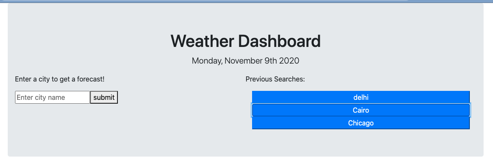
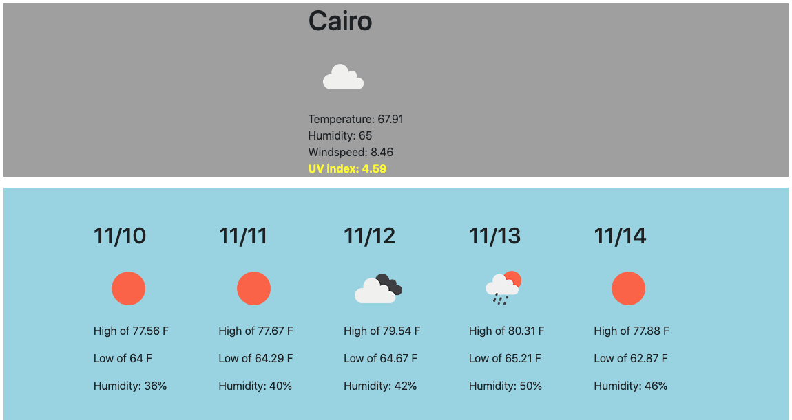

# WeatherDashboard
https://jordanbehn.github.io/WeatherDashboard/

This application serves as a weather dashboard. The use can enter in the name of a city, and the current weather will be displayed. Additionally, a 5 day forecast are displayed for that city. Previously searched cities are saved in local storage and appear as buttons. When clicked, the forecast for that city is displayed again.

